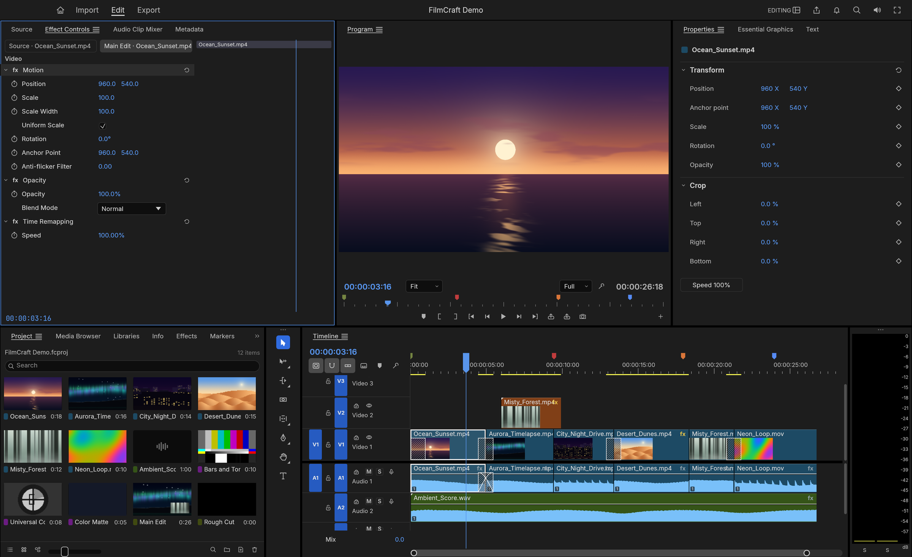

<h1 align="center">FilmCraft</h1>

<p align="center">
  <b>Non-linear video editing, reimagined in pure Rust.</b><br>
  An open-source, clean-room take on the Adobe Premiere Pro workflow: native on macOS, Windows and Linux, and in the browser via WebAssembly.<br>
  <i>By the artcraft team.</i>
</p>

<p align="center">
  
</p>

## Highlights

- **Own codecs, in Rust.** H.264 decoder (bit-exact against ffmpeg, 500+ fps at 1080p) and encoder (High profile, CABAC, B-frames, 2-pass), HEVC Main/Main 10 decoder, ProRes decode and encode, AAC-LC decode and encode, and an MP4/MOV demuxer and muxer. No FFmpeg inside.
- **Real editing.** Insert, overwrite, ripple, roll, slip, slide, rate stretch, razor, lift/extract, nesting and markers, all built on an exact integer time base (254,016,000,000 ticks per second), so frame math never drifts.
- **GPU compositing.** A wgpu compositor samples YUV directly with footprint supersampling and blends in linear light, with a matching CPU path. Playback runs in real time at 1080p, using the audio clock as master.
- **Colour.** Lumetri-style grading: basic correction, creative looks, RGB and hue curves, colour wheels, HSL secondary and vignette, plus waveform and vectorscope.
- **Keyframes.** Linear, Bezier, auto/continuous Bezier, hold and ease, with value and velocity graphs.
- **Export.** H.264 MP4 with AAC, ProRes and MJPEG MOV, PNG sequences, GIF and WAV, run as background jobs.
- **Agent-drivable.** Every action is a command. The UI, a CLI, a JSON control channel and an MCP server all drive the same engine, so Claude or any agent can edit, grade and export.

## Status

Early but moving fast: about a quarter of the way to Premiere Pro parity. See **[ROADMAP.md](ROADMAP.md)** for milestone status and estimates.

## Quick start

```sh
cargo run --release -p filmcraft                           # desktop app with the demo project
cargo run --release -p filmcraft -- --control 9876         # plus the JSON-lines control server
cargo run --release -p filmcraft-cli -- commands           # list every engine command
cargo run --release -p filmcraft-cli -- mcp                # MCP server (headless)
```

The control protocol is documented in [docs/control-protocol.md](docs/control-protocol.md).

## Architecture

A layered Cargo workspace: codecs and containers at the bottom, then frames and media, project model and edit algebra, rendering and export, the engine (command registry, session, undo), and finally the swappable UI (`ui-egui`). Nothing below the UI layer depends on a UI toolkit or OS APIs, and everything up to the engine compiles to `wasm32`. `cargo xtask ci` checks formatting, lints, tests, the layering rules and the wasm build.

## The Craft family

Open-source, clean-room, pure-Rust creative tools. Each runs natively on macOS, Windows and Linux, and on the web.

<table>
  <tr>
    <td width="20%" align="center"><a href="https://github.com/storytold/photocraft"><b>PhotoCraft</b></a></td>
    <td>Image editing and compositing, Photoshop-class: layers, masks, adjustments and byte-exact PSD/PSB round trips.</td>
  </tr>
  <tr>
    <td align="center"><a href="https://github.com/storytold/drawcraft"><b>DrawCraft</b></a></td>
    <td>Vector illustration, Illustrator-class: paths, shapes, type and artboards.</td>
  </tr>
  <tr>
    <td align="center"><a href="https://github.com/storytold/filmcraft"><b>FilmCraft</b></a></td>
    <td>Non-linear video editing, Premiere Pro-class: timeline editing, own codecs, GPU compositing, colour and export. <i>You are here.</i></td>
  </tr>
  <tr>
    <td align="center"><a href="https://github.com/storytold/lightcraft"><b>LightCraft</b></a></td>
    <td>Photo library and non-destructive raw developer, Lightroom-class: catalog, culling, develop and export.</td>
  </tr>
  <tr>
    <td align="center"><a href="https://github.com/storytold/printcraft"><b>PrintCraft</b></a></td>
    <td>PDF viewing and editing, Acrobat-class: pages, annotations, forms and document tools.</td>
  </tr>
</table>

## Clean room

FilmCraft is an independent implementation. It contains no Adobe code, assets, presets or LUTs, and no GPL/LGPL code; codecs are implemented from the public ITU-T and ISO specifications. ffmpeg is used only as an external test oracle. Adobe and Premiere Pro are trademarks of Adobe Inc.; FilmCraft is not affiliated with Adobe.
