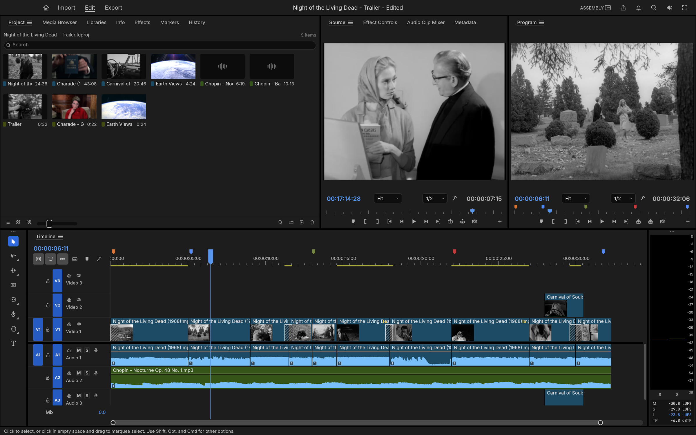
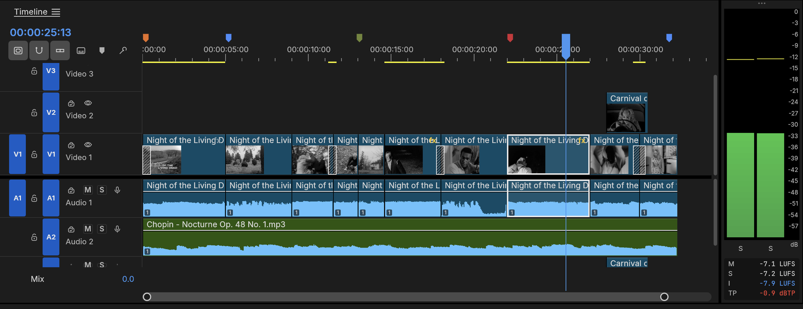
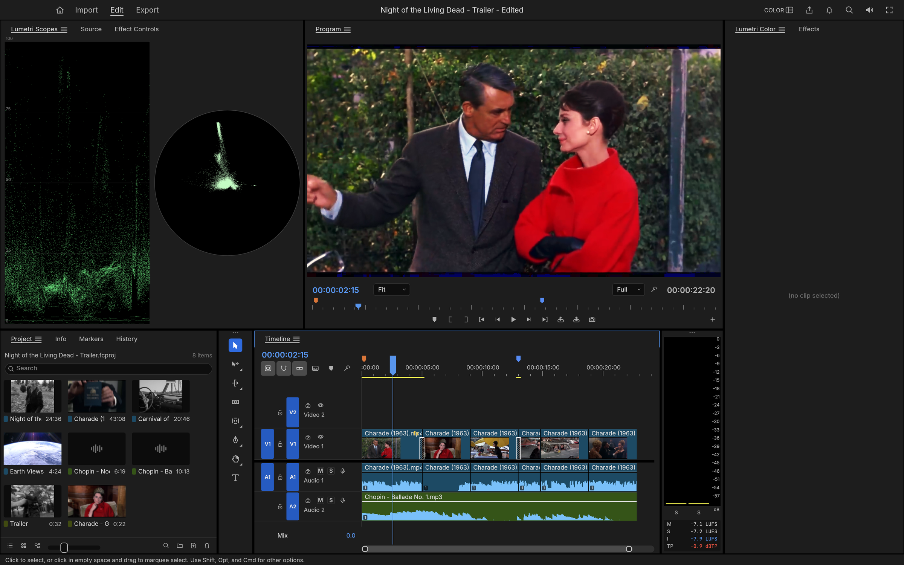
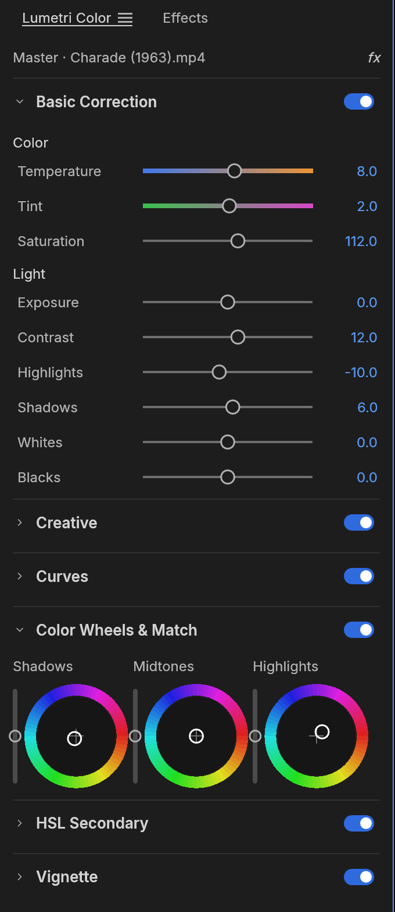
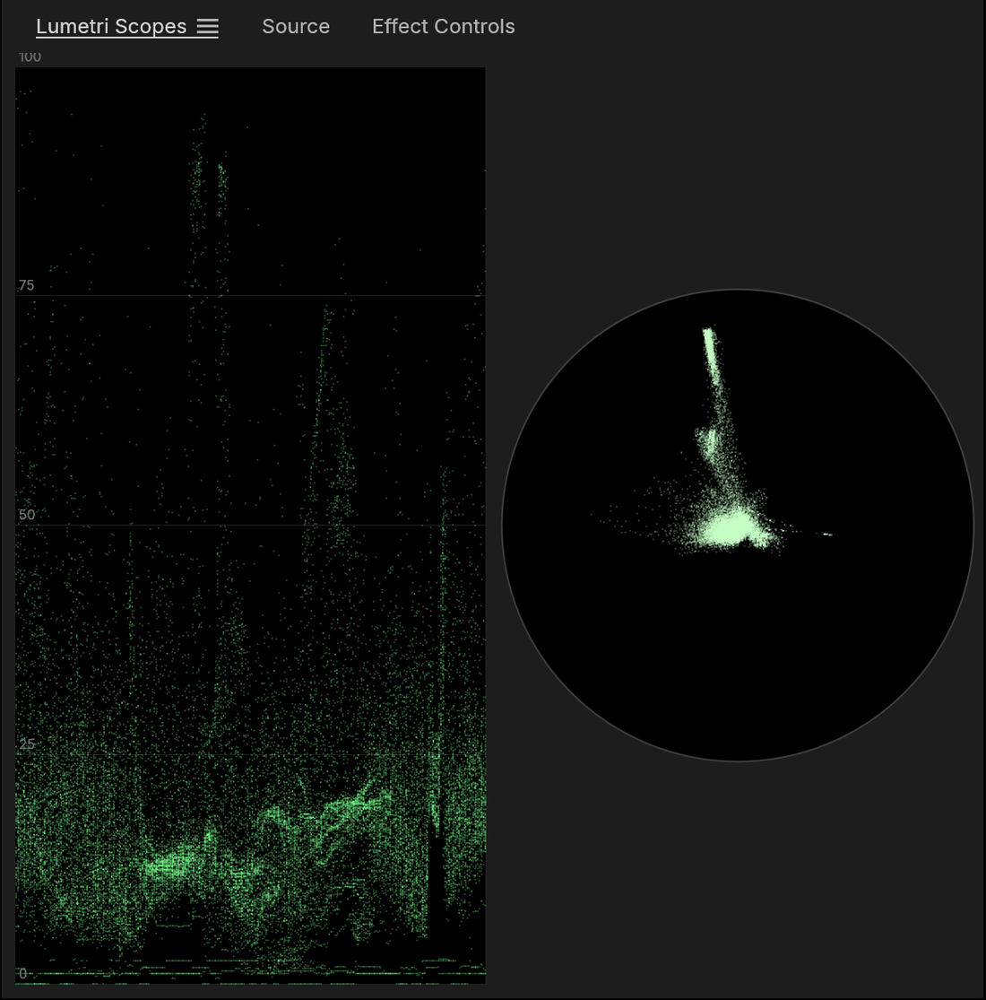
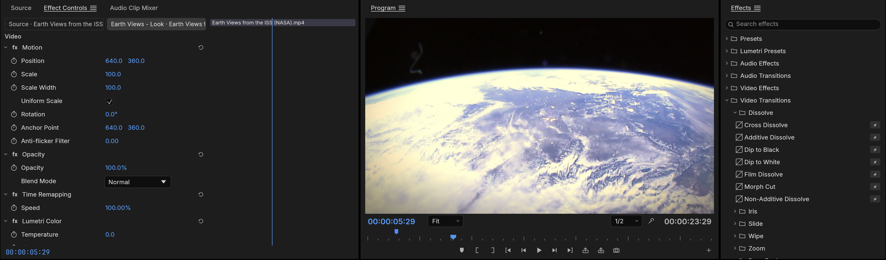
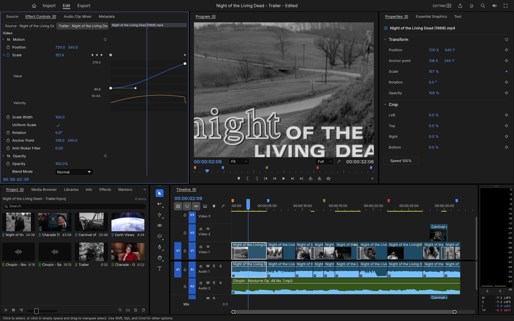
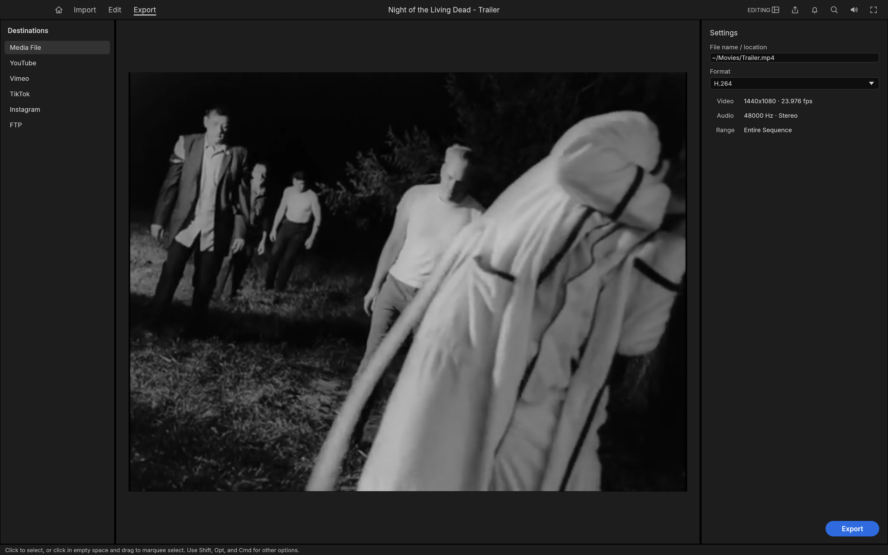

<h1 align="center">FilmCraft</h1>

<p align="center">
  <b>Professional video editing, rebuilt from scratch in pure Rust.</b><br>
  An open-source, clean-room take on the Adobe Premiere Pro workflow: native on macOS, Windows and Linux, and in the browser via WebAssembly.<br>
  <i>By the artcraft team.</i>
</p>

<p align="center">
  <a href="#edit">Edit</a> ·
  <a href="#color">Color</a> ·
  <a href="#effects-and-motion">Effects</a> ·
  <a href="#audio">Audio</a> ·
  <a href="#formats-and-codecs">Formats</a> ·
  <a href="#export">Export</a> ·
  <a href="#interchange">Interchange</a> ·
  <a href="#built-for-agents">Agents</a> ·
  <a href="#get-started">Get started</a>
</p>

<p align="center">
  
</p>

<p align="center"><sub><i>Apollo 11 &mdash; Tranquility</i>: a three-minute documentary edit of NASA's 1969 launch, landing and moonwalk film, with subtitles from the mission transcript. Every frame in these screenshots comes from public-domain footage, decoded, composited and graded by FilmCraft's own code.</sub></p>

<br>

FilmCraft is a non-linear editor for people who know Premiere: the same panels, workspaces, tools and shortcuts, so your hands already know where everything is. Underneath, it is new from the bitstream up. The H.264, HEVC, ProRes and AAC codecs are our own, written in Rust from the public specifications. A GPU compositor works in linear light. Frame math runs on exact integer time, so edits never drift. And every action in the app is a command that an AI agent can drive as precisely as you can.

<br>

## Edit

<p align="center">
  
</p>

**A timeline you already know.** Source and Program monitors, bins with thumbnails, a multi-track timeline with patch and target buttons, sync locks and linked selection. The Editing, Assembly, Color, Effects and Audio workspaces are all there, and every panel docks wherever you want it.

- **Three-point editing.** Mark In and Out in the Source monitor, then insert (`,`) or overwrite (`.`) onto the patched tracks. Lift (`;`) and extract (`'`) take ranges back out.
- **Every trim.** Ripple, roll, slip, slide, rate stretch and razor tools. Trim mode selects edit points as ripple, roll or trim, nudges them a frame at a time (`⌥←` `⌥→`, ×5 with `⇧`), toggles the trim type with `⌃T` and extends them to the playhead with `E`. `Q` and `W` ripple-trim to the playhead. The **Trim Monitor** shows both sides of the edit, and **dynamic trimming** trims live while it plays: `L` forward, `J` back, `K` to stop and commit as one undo step.
- **Exact time.** Every edit is computed on integer ticks: 254,016,000,000 per second, which divides evenly by every common frame rate and sample rate. 23.976, 29.97 drop-frame and 59.94 are exact, not approximate.
- **The details pros rely on.** Markers with colours, names and durations; add edit (`⌘K`) on one or all tracks; nesting; copy, paste and paste insert; ripple delete and close gap; snapping; unlimited undo with a History panel.
- **Your keys.** A Keyboard Shortcuts editor (`⌥⌘K`) with a drawn keyboard, panel-specific shortcuts, conflict warnings and presets for FilmCraft, Premiere Pro, Final Cut Pro and Avid key layouts.
- **Never lose work.** Saves are atomic, auto-save keeps a rolling set of versions, and a crash-recovery journal written about a second after each edit brings back unsaved changes after a crash or power cut.

<p align="center">
  
</p>

<br>

## Color

<p align="center">
  
</p>

**A complete Lumetri-style grading panel**, in the order a colourist works:

- **Basic Correction:** temperature and tint, exposure, contrast, highlights, shadows, whites, blacks, saturation.
- **Creative:** eight built-in looks with an intensity control, plus faded film, sharpen and vibrance. The looks are colour transforms written in code, not LUT files.
- **Curves:** an RGB curve editor with monotone-cubic interpolation (no overshoot), and hue vs saturation, hue vs hue, hue vs luma, luma vs saturation and saturation vs saturation.
- **Color Wheels:** shadow, midtone and highlight wheels, each with its own lightness control.
- **HSL Secondary:** key a colour by hue, saturation and luma, view the key as a matte, and correct only what you selected.
- **Vignette:** amount, midpoint, roundness and feather.

<table>
  <tr>
    <td width="34%" valign="top"></td>
    <td width="66%" valign="top"><br><br><sub><b>Scopes that tell the truth.</b> The waveform and vectorscope are computed from the graded frame. All grading happens in linear light, in 32-bit float.</sub></td>
  </tr>
</table>

<br>

## Effects and motion

<p align="center">
  
</p>

- **Around 55 video effects and 30 transitions.** Blurs, keys, distortions, stylize and colour effects. Cross dissolve, dip to black or white, film dissolve, wipes, irises, pushes, slides, zooms, page peel, cube spin and more.
- **Motion and opacity on every clip:** position, scale, rotation, anchor point and anti-flicker, plus 26 blend modes.
- **Keyframes like Premiere's:** linear, Bezier, auto and continuous Bezier, hold, ease in and ease out. Effect Controls shows a keyframe lane for every parameter, and each animated parameter opens into **value and velocity graphs** with draggable influence handles.
- **A GPU compositor** built on wgpu (Metal, Vulkan, DirectX 12, WebGPU). It samples YUV straight from the decoder with footprint supersampling and blends in linear light. A CPU path renders the same frames, and the two are tested against each other.

<p align="center">
  
</p>

<p align="center"><sub>An eased push-in on the title card: the value graph, the velocity graph and the Bezier influence handle.</sub></p>

<br>

## Audio

- **Loudness meters to broadcast standards.** Momentary, short-term and integrated loudness and true peak to ITU-R BS.1770 and EBU R128, alongside the peak meters. Our integrated reading matches ffmpeg's `ebur128` filter to the tenth of a LU.
- **Clip effects on our own DSP library:** parametric EQ, high-pass, low-pass and band-pass filters, dynamics, a true-peak limiter, delay, reverb, DeNoise, DeHummer, invert and pitch shift. Parameters can be keyframed. Effects stay continuous across scrubbing, playback and export, with latency compensated.
- **Audio Track Mixer and Audio Clip Mixer:** faders, pan, mute, solo, five insert slots per track (pre- or post-fader), sends, submixes and a Mix track, all sample-accurate and latency-compensated. 24 tracks with three effects each mix about six times faster than real time on one core.
- **Automation like a console:** Read, Latch, Touch and Write modes recorded live from the mixer during playback, shown and edited as track keyframes on the timeline. Plus the Audio Gain dialog (set, adjust, normalize) and constant-power crossfades.
- **Audio-clock playback.** The sound card is the master clock, so picture follows sound and never the other way round.

<br>

## Formats and codecs

No FFmpeg inside. The video codecs, AAC, Opus and the containers are our own Rust code, implemented from the public ITU-T, ISO and IETF specifications and tested frame by frame against ffmpeg as an external oracle.

| | Decode | Encode | Notes |
|---|:---:|:---:|---|
| **H.264 / AVC** | ✓ | ✓ | Decoder bit-exact on 37+ streams, 500–600 fps at 1080p. Encoder: High, Main and Baseline profiles, CABAC, B-frames, CRF/CBR/VBR/2-pass |
| **HEVC / H.265** | ✓ | | Main and Main 10, bit-exact on 41 streams (tiles, WPP, PCM, long-term references), about 225 fps at 1080p |
| **Apple ProRes** | ✓ | ✓ | Decodes 422 Proxy to 4444 XQ; export writes 422 HQ |
| **AAC-LC** | ✓ | ✓ | |
| **VP9** | ✓ | | Profiles 0–3, 8/10/12-bit, 4:2:0 to 4:4:4, tiles and superframes; bit-exact on 50+ streams; in WebM/Matroska and MP4 |
| **Opus** | ✓ | | SILK, CELT, hybrid and multistream surround; range-exact on every RFC 8251 conformance vector; in WebM/Matroska and MP4 |
| **MJPEG, PCM** | ✓ | ✓ | |
| **MP3, FLAC, ALAC, Vorbis** | ✓ | | Via the [symphonia](https://github.com/pdeljanov/Symphonia) crate (MPL-2.0) for now, to be replaced by our own |
| **MP4 / MOV** | ✓ | ✓ | Fragmented MP4, edit lists, timecode tracks |
| **Matroska / WebM** | ✓ | | Lacing, Cues, header stripping, HDR colour metadata |
| **Stills** | ✓ | ✓ | Import PNG, JPEG, GIF, WebP, TIFF and BMP; export PNG sequences and animated GIF |

VP9, AV1, DNxHR and MXF are next ([roadmap](ROADMAP.md)).

<br>

## Titles and captions

- **A real text engine:** OpenType shaping with kerning and ligatures, bidirectional text, line breaking, tracking and leading, drawn in linear light and sharp at any scale or rotation.
- **Type, Shape and Pen tools** on the Program monitor: click to type, edit with a caret and selection, drag out rectangles, ellipses and paths. Graphic clips hold text and shape layers with fill, strokes, background and shadow, all keyframable, and edited in the Properties panel.
- **Captions:** caption tracks in Subtitle, CEA-608, CEA-708 and Teletext formats; import and export SRT, WebVTT and SCC with frame-exact timing; edit captions in the Text panel and burn them into exports.

<br>

## Export

<p align="center">
  
</p>

- **H.264 MP4 with AAC, using our own encoders.** A 6-second 960×540 render takes 1.3 seconds and decodes cleanly in ffmpeg with error concealment switched off.
- **Also:** Apple ProRes 422 HQ and Motion JPEG in QuickTime, PNG sequences, animated GIF and WAV.
- **Background jobs** with progress and cancel, so you keep editing while it renders.
- **Render previews:** the render bar marks segments green, yellow or red; rendered previews are cached by content, so an edit only invalidates what it touches and undo brings the green back.

<br>

## Interchange

Move timelines between FilmCraft and every other editor:

- **Final Cut Pro 7 XML (xmeml):** the format Premiere and DaVinci Resolve exchange. It carries nested sequences, transitions, generators, Motion, Opacity, Time Remap and audio levels, with keyframes.
- **FCPXML 1.9–1.11:** the spine, connected clips as lanes, transitions, retiming and compound clips.
- **OpenTimelineIO:** the open interchange format of the film industry, round-tripping every FilmCraft detail through `metadata.filmcraft`.
- **CMX 3600 EDL:** the oldest format still in use, with drop-frame timecode, dissolves, wipes, speed changes (`M2`) and one EDL per track.

Import merges the document's bins, media and sequences into your project as one undoable step, and links each media file it finds on disk.

<br>

## Built for agents

Every menu item, button, slider and drag in FilmCraft is a **command** with an id, typed parameters and an enabled state. There are about 135 engine commands so far, with the rest of Premiere's catalogue on the way. The UI, the CLI, a JSON control channel and an **MCP server** all dispatch the same commands, so Claude or any agent can cut, trim, grade, mix and export exactly the way a person does. The UI can also be driven at the level of mouse and keyboard: every widget has an automation id, and agents can click, drag, type and take screenshots.

```jsonc
// over the control channel (JSON lines on TCP) or as MCP tool calls
{"method": "engine.execute", "params": {"command": "timeline.place",
  "params": {"item": 1, "track": "V1", "seconds": 0, "sourceIn": 284298240000000, "duration": 1270080000000}}}
{"method": "engine.execute", "params": {"command": "effects.setParam",
  "params": {"clip": 87, "effect": "lumetri", "param": "curve_luma", "value": [[0,0],[0.25,0.21],[0.75,0.82],[1,1]]}}}
{"method": "ui.screenshot", "params": {"path": "frame.png"}}
```

The trailer and the grades in these screenshots were built exactly this way, by an agent driving the running app.

<br>

## Everywhere

- **Native** on macOS, Windows and Linux, with a native macOS menu bar.
- **The web:** every crate up to the engine compiles to `wasm32`; the browser front end is next.
- **Swappable UI.** The interface is one crate (`ui-egui`) over the engine, so a different front end can replace it without touching editing logic.

<br>

## Get started

```sh
cargo run --release -p filmcraft                           # the desktop app, with a demo project
cargo run --release -p filmcraft -- --control 9876         # plus the JSON-lines control server
cargo run --release -p filmcraft-cli -- commands           # list every engine command
cargo run --release -p filmcraft-cli -- mcp                # MCP server (headless)
```

The control protocol is documented in [docs/control-protocol.md](docs/control-protocol.md).

## Documentation

| | |
|---|---|
| [CONTRIBUTING.md](CONTRIBUTING.md) · [docs/contributing.md](docs/contributing.md) | Setup, quality gates, commit conventions, how to add commands, effects, codecs, panels and assets |
| [AGENTS.md](AGENTS.md) | The rules every contributor must follow: assets, clean room, licences |
| [docs/architecture.md](docs/architecture.md) | Layers, data model, time base, command system, render and export pipeline |
| [docs/testing.md](docs/testing.md) | Unit, property and ffmpeg-oracle tests, accuracy criteria, benchmarks |
| [docs/agents.md](docs/agents.md) | Driving FilmCraft over MCP and the control channel; how agents develop it |
| [docs/control-protocol.md](docs/control-protocol.md) | Control-channel and MCP reference |
| [docs/project-files.md](docs/project-files.md) | `.fcproj` format, schema migrations, auto-save and crash recovery |
| [docs/graphics.md](docs/graphics.md) · [docs/captions.md](docs/captions.md) | Text engine, graphic clips and tools; caption tracks and formats |
| [ROADMAP.md](ROADMAP.md) | Milestones and estimates |

## Status

FilmCraft is young and moving fast: roughly 45% of the way to Premiere Pro parity, with editing, trimming, colour, keyframes, titles, captions, mixing, codecs and export working today. [ROADMAP.md](ROADMAP.md) tracks every milestone with estimates.

## Architecture

A layered Cargo workspace:

| Layer | Crates |
|---|---|
| Codecs and containers | `h264`, `h264enc`, `hevc`, `vp9`, `prores`, `aac`, `opus`, `isobmff`, `matroska`, `bitstream` |
| Foundations | `time`, `geom`, `color`, `frame`, `media`, `text`, `project`, `audio-dsp` |
| Editing and interchange | `edit`, `codecs`, `captions`, `format` (project files), `interchange` |
| Rendering and output | `render`, `gpu`, `export` |
| Engine | `engine`: command registry, session, undo, jobs |
| Front ends | `ui-egui`, `automation` (MCP), `apps/filmcraft`, `apps/filmcraft-cli` |
| Test support | `testkit` (ffmpeg oracles, fixtures), `golden` (golden-image tests) |

Nothing below the front ends depends on a UI toolkit or OS API. `cargo xtask ci` checks formatting, lints, tests, the layering rules, asset attribution and the wasm build.

## Crafting Apps

Open-source, clean-room, pure-Rust creative tools. Each runs natively on macOS, Windows and Linux, and on the web.

<table>
  <tr>
    <td width="20%" align="center"><a href="https://github.com/storytold/photocraft"><b>PhotoCraft</b></a></td>
    <td>Image editing and compositing, Photoshop-class: layers, masks, adjustments and byte-exact PSD/PSB round trips.</td>
  </tr>
  <tr>
    <td align="center"><a href="https://github.com/storytold/drawcraft"><b>DrawCraft</b></a></td>
    <td>Vector illustration, Illustrator-class: paths, shapes, type and artboards.</td>
  </tr>
  <tr>
    <td align="center"><a href="https://github.com/storytold/filmcraft"><b>FilmCraft</b></a></td>
    <td>Non-linear video editing, Premiere Pro-class: timeline editing, own codecs, GPU compositing, colour and export. <i>You are here.</i></td>
  </tr>
  <tr>
    <td align="center"><a href="https://github.com/storytold/lightcraft"><b>LightCraft</b></a></td>
    <td>Photo library and non-destructive raw developer, Lightroom-class: catalog, culling, develop and export.</td>
  </tr>
  <tr>
    <td align="center"><a href="https://github.com/storytold/printcraft"><b>PrintCraft</b></a></td>
    <td>PDF viewing and editing, Acrobat-class: pages, annotations, forms and document tools.</td>
  </tr>
</table>

## Credits and clean room

**Footage and music in the screenshots:** NASA's Apollo 11 film and television footage from [images.nasa.gov](https://images.nasa.gov) (launch, Launch Control Center, lunar surface and recovery) and the Apollo 11 air-to-ground voice transcript, all US Government works in the public domain (NASA does not endorse this project); *Night of the Living Dead* (1968), *Carnival of Souls* (1962) and *Charade* (1963), all in the US public domain; *Earth Views from the ISS* by NASA; Chopin's Nocturne Op. 48 No. 1 and Ballade No. 1, performed for Musopen and released under CC0. The media itself is not in this repository. Sources and details for every asset are in [ATTRIBUTION.md](ATTRIBUTION.md).

FilmCraft is an independent implementation. It contains no Adobe code, icons, images, presets or LUTs, and no GPL or LGPL code; every icon is drawn in code and every asset is openly licensed and attributed ([AGENTS.md](AGENTS.md)). ffmpeg is used only as an external test oracle. Adobe and Premiere Pro are trademarks of Adobe Inc.; FilmCraft is not affiliated with Adobe.

## License

FilmCraft is dual-licensed under [MIT](LICENSE-MIT) or [Apache-2.0](LICENSE-APACHE), at your option. Bundled assets keep their own open licences, listed in [ATTRIBUTION.md](ATTRIBUTION.md).
